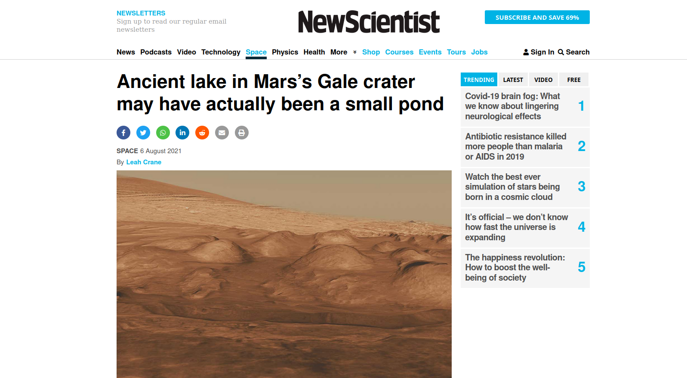

# NewsScientist Article Replica
The purpose of this project is to put what we have learned after learning how to properly use css especially the flexbox and grid. This webpage was replicated using a [NewScientist Article](https://www.newscientist.com/article/2286218-ancient-lake-in-marss-gale-crater-may-have-actually-been-a-small-pond/)

### Screenshots
